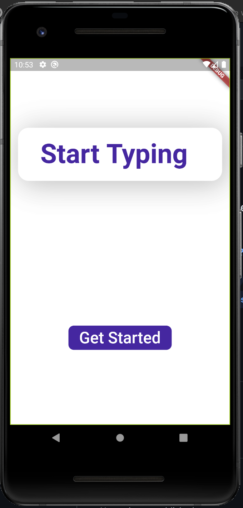
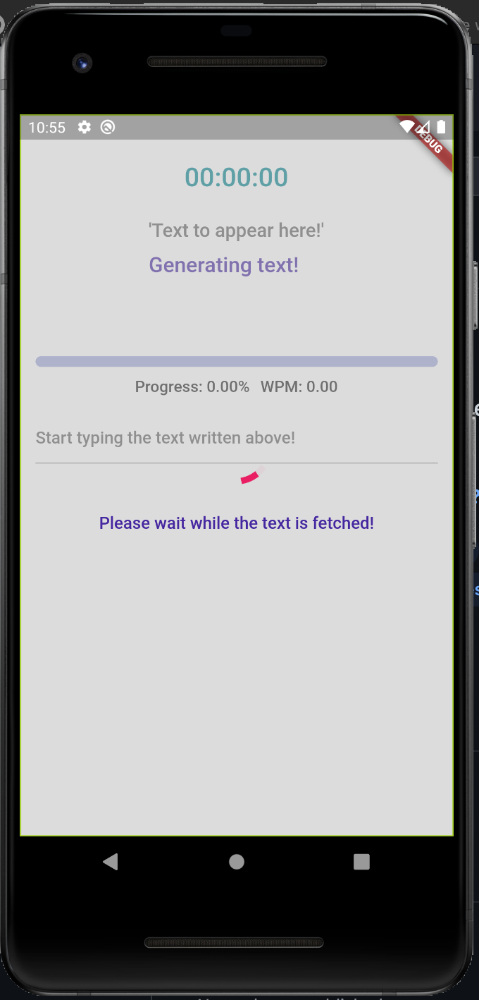
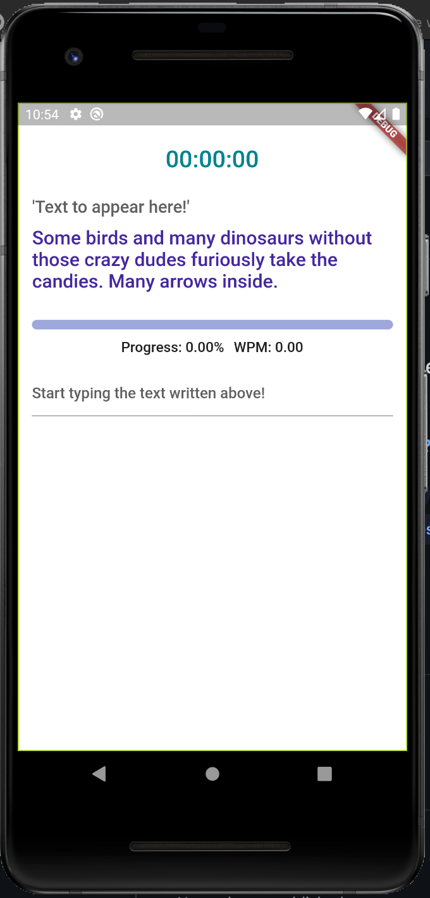
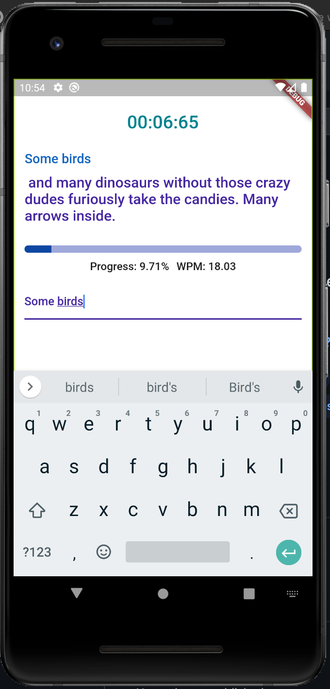
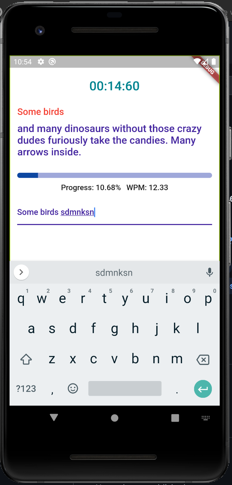
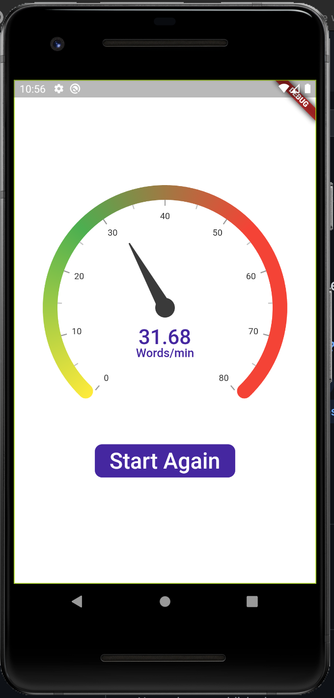

# SpeedTyper

A flutter application to check your typing speed.

[Download apk from here](https://www.icloud.com/iclouddrive/0E0_nILjj6nYXeoqFOVE5SOvQ#app-release)

# Libraries used:-
 - [Animated Text Kit](https://pub.dev/packages/animated_text_kit)
 - [Syncfusion Flutter Gauges](https://pub.dev/packages/syncfusion_flutter_gauges)
 - [Flutter Loading Overlay](https://pub.dev/packages/loading_overlay)
 - [HTTP](https://pub.dev/packages/http)
 - [Flutter Data Connection Checker](https://pub.dev/packages/data_connection_checker)
 - [Scroll Snap List](https://pub.dev/packages/scroll_snap_list)

# Screenshots

